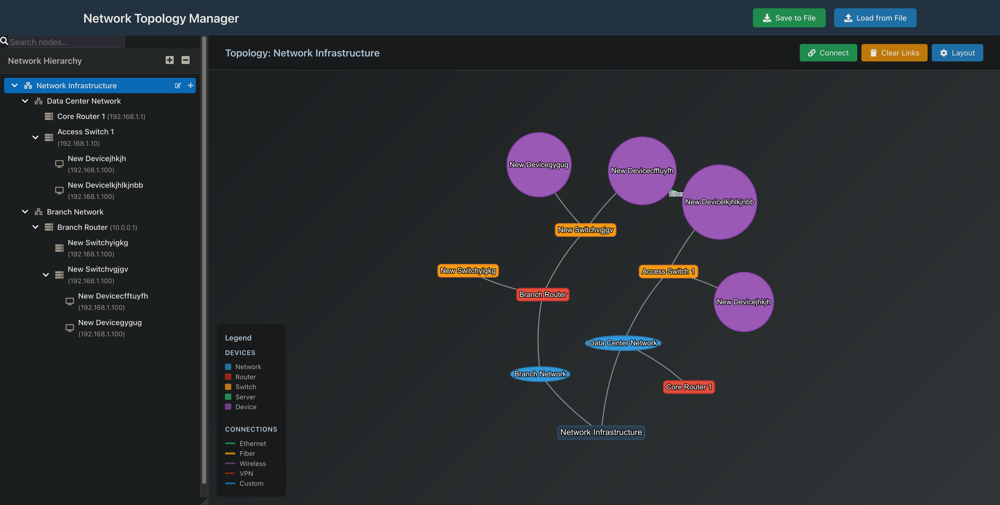

# Network Topology Manager

A React-based network topology visualization application that allows users to create and manage custom hierarchical network structures with interactive topology diagrams.

